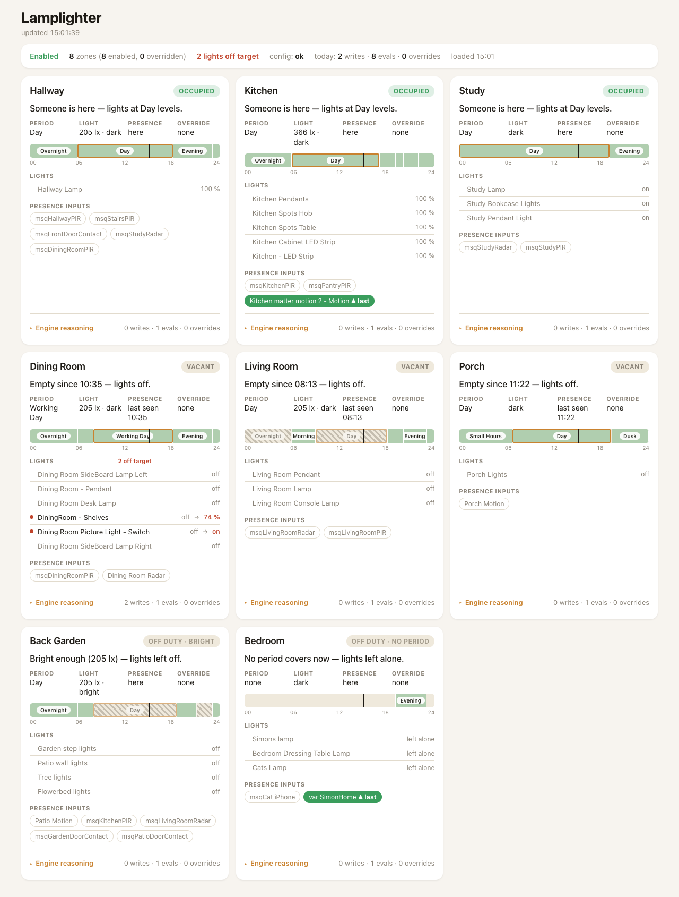
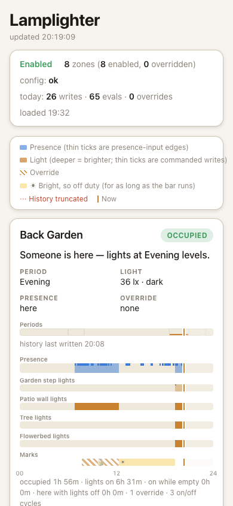

# Lamplighter

Presence- and daylight-driven lighting for [Indigo](https://www.indigodomo.com).

Lamplighter runs your lights in **zones**. Each zone watches a few presence
inputs (PIRs, radar, door contacts, an Indigo variable), optionally a lux
sensor, and a set of lights. It decides what the lights should be doing from
those inputs and the time of day, and it notices when a person has taken over
a room and backs off until they are done. Every decision comes from the
zone's inputs, never from diffing live device state, so a light that reports
late or a group that reads back a few points low cannot make it change its
mind.

**Lamplighter is built to be set up and run through an AI assistant.** There
is no zone editor. Zones live in one JSON file that the plugin validates and
hot-reloads, and a matching set of MCP tools lets an assistant read, explain
and edit that file for you. Once the two plugins are installed (two
double-clicks on the Indigo Mac, once), everything else happens from
wherever you are, by voice if you like: "add a zone called Kitchen with these
four lights and the PIR, on at dusk, off after five minutes empty", then
"why are the kitchen lights off?" See
[Set it up by talking to it](#set-it-up-by-talking-to-it).



Status: **live** since 2026-09-06, running eight zones on the author's house.
Current release: see the [releases page](https://github.com/simons-plugins/indigo-lamplighter/releases).
Successor to the `indigo-auto-lights` fork; the design and its evidence are in
[`docs/plans/PRD-indigo-lamplighter.md`](docs/plans/PRD-indigo-lamplighter.md).

## Set it up by talking to it

Install [indigo-mcp-lite](https://github.com/simons-plugins/indigo-mcp-lite)
alongside Lamplighter. It is a stdlib-only Indigo plugin that exposes your
Indigo system as an MCP server, reachable from anywhere through your Indigo
Reflector, and it ships a `lamplighter_*` tool set written for this plugin:

| Tool | What the assistant can do with it |
|------|-----------------------------------|
| `lamplighter_list_zones` | see every zone, its state and its one-line explanation |
| `lamplighter_get_zone` | read one zone's full configuration and live state |
| `lamplighter_update_zone` | change a zone: a JSON-merge patch, checked by Lamplighter's own validator before it is written, then hot-reloaded |
| `lamplighter_explain` | ask why a zone is doing what it is doing, or dry-run it at a chosen time |
| `lamplighter_reset_override`, `lamplighter_lock_zone` | release or take a manual lock |
| `lamplighter_set_enabled`, `lamplighter_reconcile_now` | switch a zone or the whole plugin on and off, re-plan every zone on the next pass |

Point any MCP client that can reach lite's endpoint with its bearer token
at it (lite's README walks through Claude Code and Claude Desktop; the same
Reflector URL is what a phone assistant's remote connector needs) and talk
to it:

- "Make a zone for the study: lights are the desk lamp and the bookcase
  strip, presence is the study radar, hold ten minutes, no daylight sensor.
  Evenings from an hour before sunset to eleven, everything on at 60."
- "The hallway should never lock when someone uses the wall switch."
- "Why is the back garden locked?" — the answer comes from the plugin's
  own reasoning, not a guess.
- "Dim the kitchen to thirty after ten at night."

The assistant finds the device ids, writes the patch, and the plugin either
accepts it and reloads within about five seconds or refuses it with the path
that is wrong, which the assistant reads back and fixes. Nothing after the
install needs a terminal or a Mac, and the zone device, the status page and
the event log all show the result straight away.

You can still edit the file by hand, and the schema below is the contract
either way. The rest of this README explains what the assistant is
configuring on your behalf.

## How a zone decides

A zone is always in one of four states:

| State | Meaning | What the lights are told |
|-------|---------|--------------------------|
| **Occupied** | presence seen within the hold time, and the room is dark | the active period's level for each light |
| **Vacant** | the presence hold has expired | off (or the period's `vacant_levels`, if set) |
| **Overridden** | somebody changed a light by hand | nothing: whatever the lights are now |
| **Off duty** | no period covers now, or the room is bright, or the zone is disabled | bright: off; otherwise left alone |

Three ideas do most of the work:

- **Presence hold.** A zone stays occupied for `hold_seconds` after the last
  presence input went off, so a PIR with a ten-second hardware hold behaves
  like a proper occupancy sensor. The hold can differ per period, so a
  kitchen can hold for an hour in the working day and fifteen minutes late at
  night.
- **Dark with hysteresis.** A zone with a lux sensor is dark below
  `dark_below` and only becomes bright again once the reading climbs
  `hysteresis` above it, so the zone's own lights cannot flip it back and
  forth. A zone with `"lux": null` follows presence around the clock.
- **Manual override.** If a light in the zone changes to something the zone
  did not ask for, a person did it. The zone locks: it stops writing for
  `duration_minutes`, extends by `extend_minutes` while the room stays
  occupied, and (with `unlock_on_leave`) releases as soon as the room
  empties. A zone can also be told never to lock, which suits a hallway light
  on a wall switch.

Every zone writes a one-line explanation of its current decision to its
`explain` state and to the event log on each transition, for example:

```
Back Garden is overridden because device 1445308831 took it over at 07:42:40,
held until 08:42:40. period=Day; presence=active (hold, last seen 08:17:26);
lux=54 STALE, read 48 min ago, dark below 100; override=1445308831.
Last trigger: presence: msqKitchenPIR.
```

## Install

**First install: double-click `Lamplighter.indigoPlugin` on the Indigo
server.** Indigo has to register the bundle itself; copying the folder into
`Plugins/` works only for *later* updates to a bundle it has already
installed.

Updating an installed plugin: copy the changed files into

```
/Library/Application Support/Perceptive Automation/Indigo 2025.2/Plugins/Lamplighter.indigoPlugin/Contents/Server Plugin/
```

and reload the plugin (Plugins → Lamplighter → Reload). States added by a
new release appear on your existing zone devices automatically; the first
start after such an upgrade logs a few one-off `state key … not defined`
errors before the state list refreshes, which is expected.

On first start the plugin creates:

- one **Lamplighter Zone** device per zone in the configuration. Its on/off
  is that zone's enable, and its states carry the zone's decision (`state`,
  `explain`, `period`, `presence_active`, `lux`, `dark`, the override, the
  desired level per light, today's counters);
- one **Lamplighter Controller** device. Its on/off is the global enable, so
  "all automation off" is one switch. It carries zone counts, summed
  counters and the configuration status.

A zone that later disappears from the configuration keeps its device: nothing
is ever deleted for you. The device says so in its `explain` state and the
plugin names it once at WARNING.

## Configuration

Zones live in one JSON file, in one fixed place. You will normally let an
assistant edit it (see above), but it is plain JSON and the schema is the
contract whoever writes it:

```
<Indigo install folder>/Preferences/Plugins/com.simons-plugins.indigo-lamplighter/lamplighter.json
```

which on a stock 2025.2 server is

```
/Library/Application Support/Perceptive Automation/Indigo 2025.2/Preferences/Plugins/com.simons-plugins.indigo-lamplighter/lamplighter.json
```

The plugin writes `{"version": 1, "zones": []}` there if the file is missing,
watches its modification time, and reloads within about five seconds of a
save.
Overrides, presence and the dark verdict survive a reload. **A file that does
not validate is refused whole**: the error names the failing path, is logged
once per edit, appears on the controller device's `config_status` state, and
the previous configuration keeps running.

A zone looks like this (see
[`examples/lamplighter.example.json`](examples/lamplighter.example.json) for
a complete file):

```json
{
  "name": "Kitchen",
  "enabled": true,
  "presence_devices": [1465867145, 735515977],
  "presence_variables": [],
  "hold_seconds": 300,
  "lux": { "device": 1616814762, "dark_below": 2200, "hysteresis": 300 },
  "lights": [772478931, 1256902388, 1990903005],
  "override": { "enabled": true, "duration_minutes": 60, "extend_minutes": 30, "unlock_on_leave": true },
  "periods": [
    { "name": "Day",  "from": "06:00",       "to": "sunset-30m", "mode": "on_and_off",
      "levels": { "772478931": "on", "1256902388": 100, "1990903005": 100 } },
    { "name": "Dusk", "from": "sunset-30m",  "to": "22:00",      "mode": "on_and_off",
      "levels": { "772478931": 50, "1256902388": 60, "1990903005": 60 },
      "vacant_levels": { "1990903005": 10 } },
    { "name": "Night", "from": "22:00",      "to": "06:00",      "mode": "on_and_off", "limit": 50,
      "levels": { "1990903005": 30 } }
  ]
}
```

The pieces:

- **`presence_devices`** are any Indigo devices with an on/off state,
  combined any-of. **`presence_variables`** are Indigo variables that count
  as presence when their value is `true`, `on`, `yes`, `1` or `home`, which
  is how a phone-at-home variable can hold a bedroom.
- **`lux`** is the daylight gate, or `null` for none. `dark_below_variable_id`
  lets an Indigo variable override the threshold, so it can be tuned from a
  control page. `when_unreadable` says what the zone believes when the
  sensor cannot be read (default `dark`, so an indoor room does not go dark
  because a sensor died).
- **`lights`** is every light the zone may command. A light not listed here
  is never written and can never create an override.
- **`periods`** are the zone's day, as non-overlapping bands. `from` and `to`
  are `HH:MM` or sunrise/sunset-relative (`sunset-1h30m`, `sunrise+20m`); a
  band whose `to` is earlier than its `from` crosses midnight. Gaps mean
  off duty: no writes. `mode` is `on_and_off` or `off_only` (never turns a
  light on, only off, for a hard-off band). `levels` gives each light an
  integer 1–100, `"on"`, `"off"` or `"leave"`; a light absent from `levels`
  is left alone in that period. `vacant_levels` dims instead of switching
  off when the room empties. `limit` caps every level in the band.
  `adjust_by_lux` is reserved and not implemented in this release: the
  loader refuses it on a zone with a lux block, so set the levels you want
  directly. A period may carry its own `hold_seconds` and its own
  `override` timing (both `duration_minutes` and `extend_minutes` must be
  given), replacing the zone's while it is active.
- **`override`** sets the manual-override behaviour described above.
  `exclude` names lights that can never *create* an override (a slow
  reporter, a group that reads back low) while still being commanded.

The schema is at
`Lamplighter.indigoPlugin/Contents/Server Plugin/lamplighter/schema.json`, and
every rule in it is also enforced by the loader with a path-precise error.

### Migrating from Auto Lights

`tools/convert_autolights_config.py` turns an `auto_lights_conf.json` into a
Lamplighter file with every zone converted and `"enabled": false`, so you can
enable zones one at a time while the two plugins run side by side. The fork
file carries no presence devices, so give each zone its inputs with
`--presence "Zone=id,id"` (and `--hold`, default 300 seconds) or the zone
will not load. Never leave both plugins pointed at the same lights: each will
see the other's writes as manual overrides.

## Status page

The plugin bundles a read-only status page: one card per zone with its state,
a plain-English verdict, the period, lux and presence facts, any manual
override with its owner and expiry, every light with the level the zone
wants next to what the light is actually doing, the presence inputs and
which one fired last, and the raw engine reasoning behind a disclosure. The
header shows the controller's enable, zone counts, configuration status and
today's totals.

Each card also carries a 24-hour timeline of what actually happened today --
today's periods as context, then presence, each light's actual reported
level, and any override or off-duty-bright marks, with a "now" line and a
stats row underneath (occupied time, lights-on time, lights left on with
nobody there, time spent in the room with the lights off, overrides, on/off
cycles) so hold times and lux thresholds can be tuned by looking. It reads
from a rolling 48-hour history the plugin has been recording since install,
written to `Web Assets/static/pages/lamplighter-history.json` independently
of the page itself -- it keeps accumulating even if you hand-edit the
bundled HTML.



The page is copied into Indigo's Web Assets on startup, and on every prefs
save with **"Manage the status page"** ticked, and served at:

```
https://<indigo-host>:8176/static/pages/lamplighter.html?api-key=<your-key>
```

The `?api-key=` form is how the page authenticates outside the dom.io app,
which discovers it automatically. Untick **"Manage the status page"** if you
hand-edit the installed copy; otherwise your changes are overwritten on the
next start or config save.

## Actions and menu

Actions, for triggers, schedules and action groups:

| Action | What it does |
|--------|--------------|
| **Reset Override** | releases a zone's lock, or every zone's |
| **Lock Zone** | creates an override without touching a light: holds the zone at whatever its lights are now, for the period's override duration |
| **Set Zone Enabled** | turns a zone on or off until the next configuration reload |
| **Reconcile Now** | re-checks every enabled zone immediately |
| **Explain Zone** | logs one zone's reasoning; give a local time (`YYYY-MM-DDTHH:MM`) to dry-run the zone at that moment instead, with nothing written |

Plugin menu: **Print zone states**, **Explain all zones**, **Reload
configuration now**.

Turning a zone device off disables that zone; turning the controller device
off stops every zone writing.

## Claude and other assistants

The `lamplighter_*` tools described in [Set it up by talking to
it](#set-it-up-by-talking-to-it) are the intended way to run this plugin day
to day. Two design choices make that safe: every edit an assistant proposes
goes through the plugin's single validator (the hidden `Validate
Configuration` action) before anything is written, so a bad patch is refused
with a path rather than half-applied; and the `explain` state, the `Explain
Zone` action and the status page all expose the same reasoning text, so the
assistant tells you what the plugin actually decided instead of inferring it
from the event log.

## Reading the event log

- `Kitchen: vacant -> occupied (presence: msqKitchenPIR); ...` — a transition,
  with the input edge that caused it and the values that fed the decision.
- `Back Garden: override taken by device 1445308831 at 07:42:40, holding 60 min ...`
  — a light changed to something the zone did not command. Find what changed
  it (a wall switch, a scene, another plugin) if you did not expect a lock.
- `Dining Room: DiningRoom - Shelves (1431420103) did not reach its desired level ...`
  — the zone commanded a light and it did not land. The zone retries on a
  backoff and then every ten minutes; the light, not the plugin, is what to
  look at.
- `lux=291 STALE, read 36 min ago` in an explain line — the lux sensor has not
  reported for a while. The zone keeps its last verdict.

## Development

```sh
python3 -m venv .venv
.venv/bin/pip install -r requirements-dev.txt
.venv/bin/python -m pytest -q
```

The suite runs against a fake `indigo` module (`tests/conftest.py`). Every
promise in PRD section 7 has one test, named for the wrong implementation it
would catch, and each was verified by applying that mutation and watching
the test fail. `xfail_strict = true` in `pyproject.toml` remains: a
placeholder that starts passing fails the suite.

`tests/test_schema.py` validates the bundled schema against the JSON Schema
2020-12 metaschema, validates the example file, and checks that a table of
invalid documents fails at the path a config author would need to see.

Pull requests need a `PluginVersion` bump in `Info.plist` (patch for fixes,
minor for user-visible changes); a merge to `main` publishes a release.
